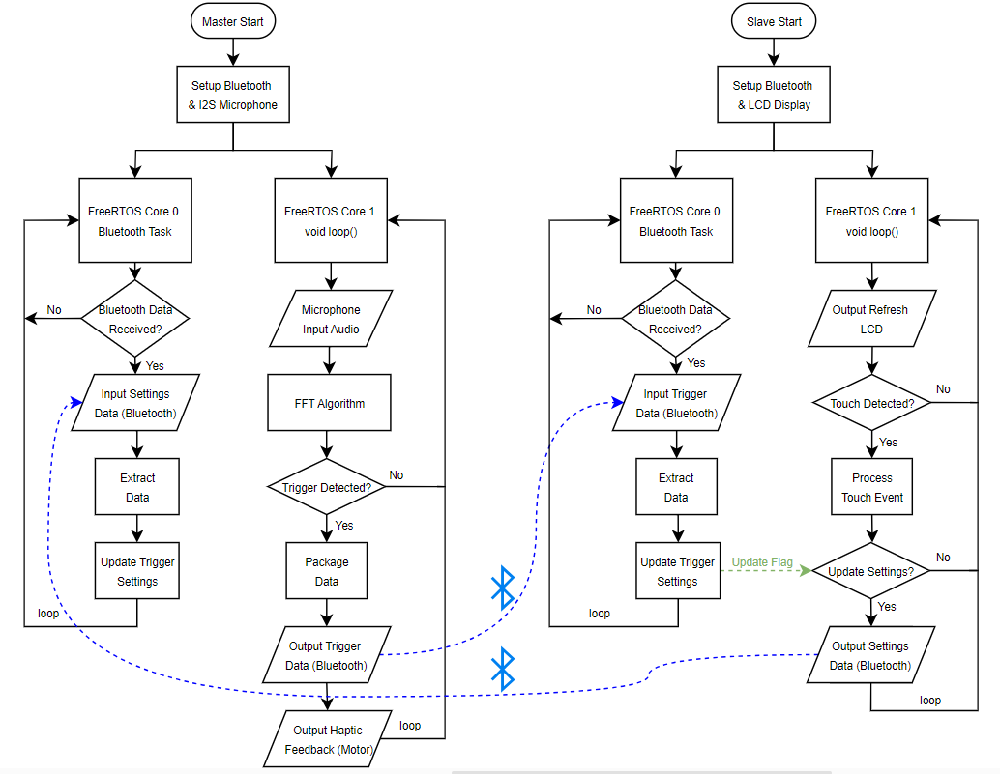

# ambient-sound-monitor-system-xylyrnth

Xylyrnth is an intelligent ambient sound monitoring system designed for the smartwatch market, targeting users who may struggle to stay aware of their surroundings or frequently find themselves in noisy environments. By employing a Fast Fourier Transform (FFT) algorithm, Xylyrnth identifies key sounds and provides alerts through haptic and visual feedback.

The system consists of two interconnected components: the bracelet (master) and the display (slave), which communicate via Bluetooth. The bracelet continuously monitors the ambient environment, alerting users through haptic feedback, while the display enables users to customize the key sounds to detect and configure alert preferences. The operating principle is shown below.

This repository is provided as an archive for the Xylyrnth project and will not undergo further development or updates. The system was specifically designed to function with two custom ESP32 hardware PCB boards, which I developed. Due to the tailored nature of these hardware components and their integration within the system, it is not suitable for general-purpose use or adaptation. This repository is shared primarily as a reference for those interested in the project’s design and implementation.

